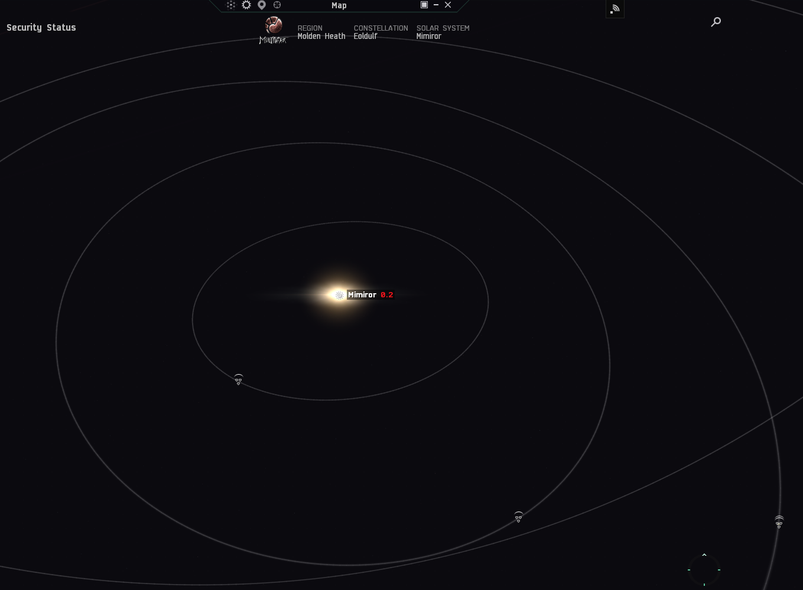
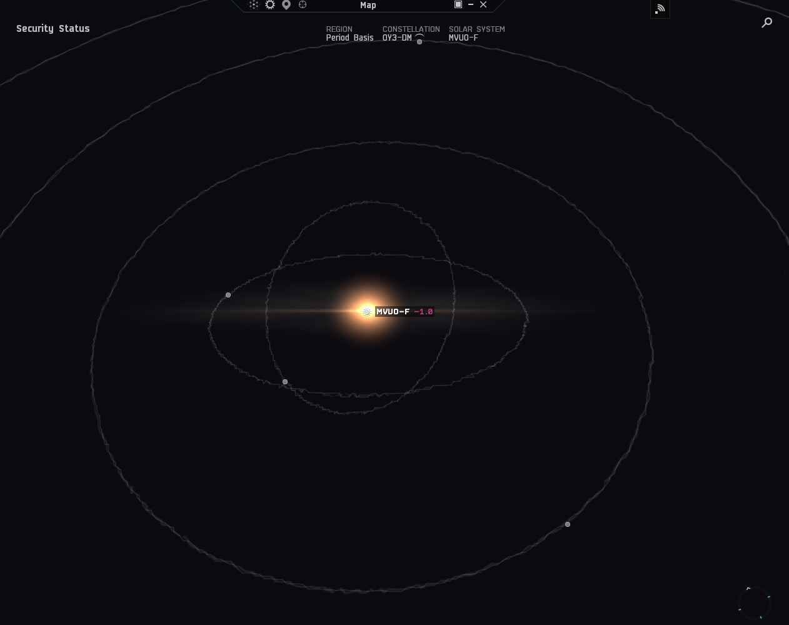

# Map data

The SDE has a wide variety of map data available. The position data is split into two groups each existing on their own separate coordinate system.
* The Universe Map; The positions of each star system
* A Solar System map; The positions of the celestial bodies (planets/moons/etc) within one 'solar system'/star system.

## General Information

Coordinates are given in metres; Both maps have the same scale.

## Universe Map

The Universe Map exists as one single coordinate system, within which each star system has it's position.
This includes the abyssal, wormhole-space, and void regions.

When displayed by the in-game map the universe is given a 'fake' North, with maps looking top down and orienting the region of 'Venal' at the top.
Only the New Eden systems (SolarSystemID in the range `30,000,000 to 30,999,999`) are included on both the in-game and (generally) player made, as the other areas of the game are quite distant and require an empty zoomed out map.

In this orientation, the coordinates have the following directions:
* `+X` is East/Right, `-X` is West/Left.
* `+Y` is Up, `-Y` is Down.
* `+Z` is North/Forward, `-Z` is South/Backward

Caution: This forms a **Left**-Handed coordinate system. When using a Right-Handed 3D graphics library (such as Three.js), the coordinates must be 'mirrored' by inverting one of the axes.

Caution: The 'max' and 'min' fields of the SDE are inconsistent with the position coordinates, the minimum and maximum `Z` values are inverted. In most cases the `Z` position will not be in the range `Z_min to Z_max`, there are two workarounds:
* Negate and swap z-axis Min and Max values `(Z_min, Z_max) = (-Z_max, -Z_min)`
* Negate z coordinate in positions; `Z_min < -z < Z_max` does work. (This changes the coordinate system described above, and changes the 'Handedness')

The origin of these coordinates lies near Zarzakh, slightly to the right of the middle of the New Eden Cluster. (See red dot on image below)


### 2D projection

The conventional map projection is "top-down". Each Y-coordinate is ignored and assumed to be zero.  

When drawing an image where the (0,0) origin is at the top-left of the screen, a star's location on the image is given by an X and Y coordinate, X<sub>img</sub> and Y<sub>img</sub>. These map onto the SDE coordinates as follows:
* X<sub>img</sub> = X<sub>sde</sub>
* Y<sub>img</sub> = -Z<sub>sde</sub>

With a corner-origin, the coordinates must be shifted to avoid systems being clipped out of the image, see code example:

```python
# Using 'Pillow' for image drawing.
# Let `system_coordinates` be a list of `(x, y, z)` tuples, with coordinates as specified in the SDE

from PIL import Image, ImageDraw

# Image config
IMG_SIZE = 1024
STAR_RADIUS = 1

# Determine bounding-box
xMin, xMax, zMin, zMax = 0,0,0,0
for (x, y, z) in system_coordinates:
    xMin = min(xMin, x)
    xMax = max(xMax, x)
    zMin = min(zMin, z)
    zMax = max(zMax, z)

SCALE = IMG_SIZE / max((xMax - xMin), (zMax - zMin))    # Scale multiplier
ASPECT_RATIO = (xMax - xMin) / (zMax - zMin)            # The cluster is not perfectly square, adjust image width to match aspect ratio

img = Image.new("RGBA", (int(IMG_SIZE * ASPECT_RATIO), IMG_SIZE), (0, 0, 0, 255))
draw = ImageDraw.Draw(img)

for (x, y, z) in system_coordinates:
    draw.circle(
        (
            (x-xMin)*SCALE, # Image X coordinate: The SDE X coordinate, offset such that the minimum SDE X coordinate is X=0 in the image. Multiplied by SCALE such that the maximum SDE x coordinate is the image width/maximum x
            (zMax-z)*SCALE  # Image Y coordinate: The SDE Z coordinate, mirrored and offset such that the *maximum* SDE Z coordinate is Y=0 in the image. Multiplied by SCALE such that the *minimum* SDE Z coordinate is  is the image height/maximum y
        ),
        STAR_RADIUS,
        fill=(255, 255, 255, 255)
    )

img.show()
```

## Solar System Map

Each star system in the game has its own isolated coordinate system, with the star at the `(0, 0, 0)` origin, with planets & other celestial objects having their positions given relative to the star.

When matching the 'Space North' orientation used for the in-game maps the coordinate system is as follows:

In this orientation, the coordinates have the following directions:
* `+X` is West/Left, `-X` is East/Right.  
  (NOTE: This is the OPPOSITE of the X-axis for the 'universe' coordinate system.)
* `+Y` is Up, `-Y` is Down.
* `+Z` is North/Forward, `-Z` is South/Backward


### 2D projection

The conventional map projection is "top-down". Each Y-coordinate is ignored and assumed to be zero. 

When drawing an image where the (0,0) origin is at the top-left of the screen, a celestial body's location on the image is given by an X and Y coordinate, X<sub>img</sub> and Y<sub>img</sub>. These map onto the SDE coordinates as follows:
* X<sub>img</sub> = -X<sub>sde</sub>
* Y<sub>img</sub> = -Z<sub>sde</sub>

With a corner-origin, the coordinates must be shifted to avoid systems being clipped out of the image, see code example:

```python
# Using 'Pillow' for image drawing.
import math
from PIL import Image, ImageDraw

# Let `planet_coordinates` be a list of `(x, y, z, name)` tuples, with coordinates as specified in the SDE. Example data below
planet_coordinates = [
    (0.0, 0.0, 0.0, "Jita - Star"),
    (-35639949630.0, -6225947509.0, 20551935633.0, "Jita I"),
    (29476716044.0, 5149291420.0, -46417511315.0, "Jita II"),
    (124056083719.0, 21671373654.0, 16235707106.0, "Jita III"),
    (-107354576606.0, -18753785170.0, 436797007078.0, "Jita IV"),
    (-639929607985.0, -111789387758.0, -1118379774140.0, "Jita V"),
    (2907924314430.0, 507985682645.0, -950946134275.0, "Jita VI"),
    (-2275005926410.0, -397421085828.0, 3223734974750.0, "Jita VII"),
    (-4067664386090.0, -710580828973.0, -3956610895960.0, "Jita VIII")
]

# Image config
IMG_SIZE = 1024
DOT_SIZE = 2.5

# Determine bounding-box
xMin, xMax, zMin, zMax = 0, 0, 0, 0
for (x, y, z, name) in planet_coordinates:
    xMin = min(xMin, x)
    xMax = max(xMax, x)
    zMin = min(zMin, z)
    zMax = max(zMax, z)

SCALE = IMG_SIZE / max((abs(xMax - xMin)), abs(zMax - zMin))

# Create a square image
img = Image.new("RGBA", (IMG_SIZE, IMG_SIZE), (0, 0, 0, 255))
draw = ImageDraw.Draw(img)

# For log scaling, coordinates must be converted from their original 'linear' form
# This function returns a logarithmic scaling in the range -0.5 to 0.5, which spans a length of 1.0 and can be multiplied with the image width to get pixel positions
ADDITIONAL_DOWNSCALE = 10_000_000_000.0 # Dividing all coordinates by a constant factor moves everything closer to the star (the origin), reducing empty space in the middle of the map.
def log_scale(value, maximum):
    if value == 0: # Log of 0 is undefined
        return 0
    else:
        # Negative log is undefined, so calculate log for absolute value, then copy back the original sign
        abs_log = math.log(abs(value / ADDITIONAL_DOWNSCALE)) / math.log(maximum / ADDITIONAL_DOWNSCALE)
        return math.copysign(abs_log,value) / 2  # The above gives us a number in the range -1.0 to 1.0, this is divided by 2 to yield our -0.5 to 0.5 range.


for (x, y, z, name) in planet_coordinates:
    xy = (
        (-x * SCALE) + (img.width / 2), # Image X coordinate: The SDE X coordinate, negated to mirror this direction, then scaled to fit and offset to move the origin to the center of the image.
        (-z * SCALE) + (img.height / 2) # Image Y coordinate: The SDE Z coordinate, negated to mirror this direction, then scaled to fit and offset to move the origin to the center of the image.
    )
    # Alternatively, for logarithmic scaling:
    # xy = (
    #     (log_scale(-x, SIZE) * IMG_SIZE) + (img.width / 2),
    #     (log_scale(-z, SIZE) * IMG_SIZE) + (img.height / 2)
    # )

    draw.circle(xy, DOT_SIZE, fill=(255, 255, 255, 255))
    if len(name) > 0:
        draw.text(xy, name)

img.show()
```

Tip: Use logarithmic scaling for non-zoomable maps. (The amount of empty space in the center of a logarithmic map can be reduced by scaling down all coordinates by a fixed amount. E.g. for the Jita system map shown above, logarithmic scaling and an additional scaling factor of 10,000,000,000 metres is used)  

## Combining the two maps

Both coordinate systems have the same scale but different coordinate systems, to get the position of a planet within the larger 'universe' coordinate system, it's position can be added to that of the parent star with the x coordinate negated:
> x = x<sub>system</sub> - x<sub>planet</sub>  
> y = y<sub>system</sub> + y<sub>planet</sub>  
> z = z<sub>system</sub> + z<sub>planet</sub>

Caution: 32-bit floating point numbers do not have enough precision to handle both the 'large' scale of the interstellar distances and the 'small' scale of interplanetary distances. This will result in a loss of precision and graphical glitches for star systems further away from the origin.

This problem can be mitigated by either using 64-bit floating point numbers or by using "Floating Origin".  
// TODO: Expand on what floating origin is because there's no wikipedia article or good guide immediately available when searching for 'Floating Origin'.

|                     Near origin                      |                     Far away from origin                     |
|:----------------------------------------------------:|:------------------------------------------------------------:|
|  |  |